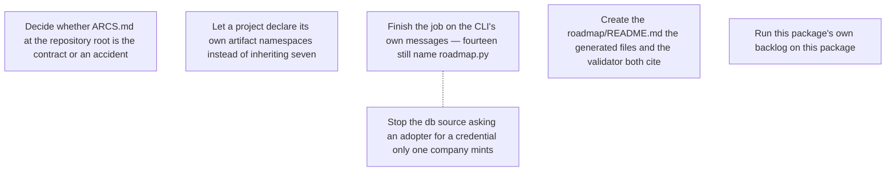

# ROADMAP.md — open work items

<!-- GENERATED FILE — DO NOT EDIT BY HAND. Regenerate with `roadmap sync`. -->

This is the agent-readable projection of the roadmap graph; the store is the `roadmap_items` table (see `roadmap/README.md`). For when it was last regenerated ask git — `git log -1 --format=%cI -- roadmap/ROADMAP.md` — because nothing in this file is derived from the clock or from a graph-wide total, so that two branches editing different items merge cleanly. Do not add one back.

`ARCS.md` is the narrative layer — *why* an arc is open. This file is the work-item layer — *what* is claimable right now, and who holds it.

## ▶ Ready — startable now

Claim before starting: `roadmap claim <key>`

**In priority order, most important first.** An item with no marker carries no stated priority — take it as unjudged, not as low. The order within a band is alphabetical and means nothing.

- `now` **`cli-messages-name-a-script-that-does-not-exist`** — Finish the job on the CLI's own messages — fourteen still name roadmap.py
  - ↔ related: **`credential-error-names-one-repos-secret`** — Same sweep, same file, different string class — land them together or the second PR re-reads the same 2000 lines. That one is about a command name; this one is about environment variables and an error message, so neither grep finds the other.
- `next` **`artifact-namespaces-are-one-projects`** — Let a project declare its own artifact namespaces instead of inheriting seven
- `next` **`credential-error-names-one-repos-secret`** — Stop the db source asking an adopter for a credential only one company mints
  - ↔ related: **`cli-messages-name-a-script-that-does-not-exist`** — Same sweep, same file, different string class — land them together or the second PR re-reads the same 2000 lines. That one is about a command name; this one is about environment variables and an error message, so neither grep finds the other.
- `later` **`arcs-md-path-is-not-configurable`** — Decide whether ARCS.md at the repository root is the contract or an accident
- `later` **`generated-file-points-at-an-uncreated-readme`** — Create the roadmap/README.md the generated files and the validator both cite

## ⏸ Deferred — startable, deliberately not now

_Nothing deferred._

## 🔒 Claimed — someone is on these

_Nothing claimed._

## ⛔ Blocked

_Nothing blocked._

## Dependency graph

## Items

### `arcs-md-path-is-not-configurable`

- **title:** Decide whether ARCS.md at the repository root is the contract or an accident
- **status:** ready
- **arc:** the-floor-as-shipped
- **priority:** later
- **refs:**
  - `roadmap_core/cli.py`
  - `https://github.com/gald33/switchboard/pull/154`

evidence

> The two generated files land in different places:
>
>     GENERATED_MD      = REPO_ROOT / "roadmap" / "ROADMAP.md"     (cli.py:109)
>     GENERATED_ARCS_MD = REPO_ROOT / "ARCS.md"                    (cli.py:113)
>
> One is namespaced under `roadmap/`, its sibling is dropped in the repository
> root. Nothing in the code says why, and the asymmetry is invisible until you
> adopt the package and a file you did not ask for appears next to your README.
>
> Measured cost, not hypothetical: adopting this in `switchboard` needed a
> paragraph in that repo's `roadmap/README.md` warning contributors NOT to tidy
> `ARCS.md` into `roadmap/`, because `sync --check` compares against the hard-coded
> path and moving it turns CI red on a file it cannot find. Every adopter will
> either write that paragraph or discover it from a red build.
>
> Root placement may well be deliberate — an arcs narrative is for humans browsing
> the repo, and burying it one directory down does reduce the chance anyone reads
> it. That is a defensible answer. It is just not written down anywhere, and the
> next person to look at these two constants will read it as an oversight and
> "fix" it.
>
> So the work is to decide and then make the decision enforce itself: either move
> it under `roadmap/` with the other generated file, or keep it and say why in a
> comment next to the constant. `later` because nothing is broken — a documented
> wart is survivable, an undocumented one is what this is.

### `artifact-namespaces-are-one-projects`

- **title:** Let a project declare its own artifact namespaces instead of inheriting seven
- **status:** ready
- **arc:** adoptable-by-anyone
- **priority:** next
- **refs:**
  - `roadmap_core/graph.py`

evidence

> `ARTIFACT_PREFIXES` is a fixed tuple of seven namespaces, and every one belongs
> to the project this package came from:
>
>     ('alembic', 'module', 'roadmap', 'web', 'docs', 'config', 'script')
>
> `validate_graph` reports any token outside it. Reproduced in a scratch project,
> using the exact resource-name shape switchboard's own `docs/seam.md` recommends
> for compiling a static collision into a name:
>
>     $ roadmap validate
>     error: a-thing: unknown artifact namespace 'artifact' in
>     'artifact:migrations-counter' — one of alembic, module, roadmap, web,
>     docs, config, script, or add it deliberately
>
> So the documented cross-tool pattern fails validation out of the box. "Or add it
> deliberately" is the right instinct and points at the bug: it invites an adopter
> to edit a constant inside an installed package, which they cannot do without
> vendoring it.
>
> The field is warn-only by design, and that is what keeps this at `next` rather
> than `now` — nothing is blocked, the edge still surfaces the contention. But a
> warning every adopter learns to ignore is the failure mode the field's own
> comment names: "a typo'd token silently matches nothing, which is the one
> failure mode of a warn-only field — it looks declared and warns about nothing."
> A namespace list nobody can extend produces exactly that habit.
>
> Cheapest shape that keeps the typo guard: read the allowed set from the
> project — a key in `roadmap/README.md`'s frontmatter, or a `roadmap/config.yaml`
> — and fall back to the current tuple when absent, so nothing changes for the
> repo that has one today.

### `cli-messages-name-a-script-that-does-not-exist`

- **title:** Finish the job on the CLI's own messages — fourteen still name roadmap.py
- **status:** ready
- **arc:** adoptable-by-anyone
- **priority:** now
- **related to** (not a dependency — both are startable):
  - `credential-error-names-one-repos-secret` — Same sweep, same file, different string class — land them together or the second PR re-reads the same 2000 lines. That one is about a command name; this one is about environment variables and an error message, so neither grep finds the other.
- **refs:**
  - `https://github.com/gald33/roadmap-core/pull/1`
  - `https://github.com/gald33/roadmap-core/pull/2`
  - `roadmap_core/cli.py`

evidence

> PR #1 fixed the strings the *generated markdown* emits and introduced
> `graph.CLI` for them. PR #2 (merged as 2015b48, released 0.2.1) fixed four more
> in the CLI itself. Neither finished the sweep.
>
> Recounted on `main` at 2015b48, after #2 landed: zero strings say `python
> scripts/roadmap.py`, and **fourteen** still say bare `roadmap.py`. Those are the
> ones no grep for the old form will ever surface, which is why the sweep looked
> finished:
>
>     365   re-run `roadmap.py pull` afterwards and check the file
>     814   seed it with `roadmap.py push` first
>     851   right, run `roadmap.py status <key> done`
>     856   If this file predates a `prune`, run `roadmap.py pull`
>     952   refiled, run `roadmap.py refile <key>`
>     998   Run `roadmap.py pull` first
>     1002  `roadmap.py prune` when you are ready to clear it
>     1043  Fix: `roadmap.py pull`
>     1048  Fix: `roadmap.py push`
>     1263  `roadmap.py diff` shows the gap
>     1291  then `roadmap.py release <key>`
>     1315  Release what you are done with — `roadmap.py release <key>`
>     1753  Run `roadmap.py pull` first
>     1813  when you finish or stop: `roadmap.py release <key>`
>
> Observed rather than only grepped: running `roadmap ready` in a scratch project
> with one item prints
>
>     note: claims here are the committed projection and can lag the store.
>     `--source db` is authoritative; `roadmap.py diff` shows the gap.
>
> There is no `roadmap.py` on an adopter's PATH. The console script is `roadmap`.
> Every one of these is advice a reader cannot act on, and they appear at exactly
> the moments someone is stuck — a stale file, a lost claim, a drifted store.
>
> Do it as a sweep with a guard, not string by string. A test asserting no
> user-facing string in `cli.py` matches `roadmap\.py` is what stops the
> nineteenth from being added next month; that is the shape PR #1 used for the
> markdown, and it is the only reason this count is knowable at all.

### `credential-error-names-one-repos-secret`

- **title:** Stop the db source asking an adopter for a credential only one company mints
- **status:** ready
- **arc:** adoptable-by-anyone
- **priority:** next
- **related to** (not a dependency — both are startable):
  - `cli-messages-name-a-script-that-does-not-exist` — Same sweep, same file, different string class — land them together or the second PR re-reads the same 2000 lines. That one is about a command name; this one is about environment variables and an error message, so neither grep finds the other.
- **refs:**
  - `roadmap_core/cli.py`

evidence

> Three adopter-facing surfaces name the project this package was extracted from:
>
> * **`--help`.** The module docstring, which argparse prints, says the db source
>   is "the live graph via `GET /admin/roadmap` (needs LUCILLE_ADMIN_JWT)". That
>   is the first thing an adopter reads.
> * **The credential error** (`_api`, cli.py:702-708):
>
>       LUCILLE_ADMIN_JWT is not set — needed for the db source.
>       Mint one with the `mint-admin-jwt` skill, or use --source files.
>
>   The remedy it offers is a skill that exists in one private repository.
> * **The defaults**: `DEFAULT_BACKEND` reads `LUCILLE_BACKEND_URL` (cli.py:137)
>   and the write lock's TTL reads `LUCILLE_ROADMAP_LEASE_TTL` (cli.py:153).
>
> Worth being precise about the blast radius, because it is smaller than it looks
> and that changes the priority: read commands default to `--source files`, so a
> bare `roadmap ready` in a fresh project works and never touches any of this.
> Verified in a scratch checkout. It is the *write* commands that default to `db`
> (cli.py:1932), so `roadmap push` with no `ROADMAP_SOURCE` is where an adopter
> meets it.
>
> The fix is not to delete the concept — a served store is a real mode. It is to
> name the variables after this package and let a host map its own: something like
> `ROADMAP_API_TOKEN` / `ROADMAP_API_URL`, with the Lucille names accepted as
> fallbacks so its shim keeps working.

### `generated-file-points-at-an-uncreated-readme`

- **title:** Create the roadmap/README.md the generated files and the validator both cite
- **status:** ready
- **arc:** the-floor-as-shipped
- **priority:** later
- **refs:**
  - `roadmap_core/graph.py`
  - `README.md`

evidence

> Two places send a reader to `roadmap/README.md`, and nothing ever writes one.
>
> * Every generated `ROADMAP.md` opens with "the store is the `roadmap_items`
>   table (see `roadmap/README.md`)".
> * `validate_graph`'s missing-evidence error is literally
>   "no evidence — see roadmap/README.md rule 2".
>
> There is no `roadmap new`, no `roadmap init`, and the adoption instructions in
> this package's README are `mkdir -p roadmap/items` — so an adopter who follows
> them exactly ends up with two artifacts citing a file they were never told to
> write. The second one is worse than a dead link: it cites a *rule number* in a
> document that does not exist, so the error explains itself by reference to
> nothing.
>
> Two honest fixes, and they are not the same amount of work:
>
> 1. **Make the messages self-contained.** Have the evidence error say what
>    evidence is for rather than delegating to a rule number, and drop the
>    parenthetical from the header. Small, and removes the dangling reference
>    without adding a feature.
> 2. **Ship the file.** A `roadmap init` that writes a starter `roadmap/README.md`
>    alongside `roadmap/items/`. Bigger, and it cuts against "authoring an item is
>    writing a YAML file, there is no `roadmap new`" — though a one-time scaffold
>    is a different thing from a per-item command.
>
> `later` because a reader who does not find the file loses an explanation, not a
> command — everything still works. Doing (1) alone would already be worth it, and
> is the version to start from.

### `roadmap-core-runs-its-own-roadmap`

- **title:** Run this package's own backlog on this package
- **status:** done
- **arc:** the-floor-as-shipped
- **refs:**
  - `https://github.com/gald33/switchboard/pull/154`
  - `.github/workflows/roadmap.yml`

evidence

> A tool for tracking work that did not track its own. Every claim this package
> makes about being adoptable was tested somewhere else — `tests/test_adoption.py`
> against a scratch directory, and then for real in `switchboard` — while the
> repository that ships it had no `roadmap/` at all.
>
> That gap is how the two defects fixed in PR #1 survived: the generated header
> and the ARCS.md preamble named paths from the project this was extracted from,
> and nobody read them here because nothing here generated them. They were found
> by an outside adopter on first contact.
>
> Now the floor runs on itself: `roadmap/items/*.yaml`, `roadmap/arcs/*.yaml`, the
> committed `roadmap/ROADMAP.md` and `ARCS.md`, and a `roadmap` CI job.
>
> **One deliberate difference from `templates/roadmap.yml`, and it is the point of
> doing this at all.** The template tells an adopter `pip install
> "roadmap-core[files]"`, which resolves the last *release*. This repository's job
> installs the checkout (`pip install ".[files]"`) instead, so the roadmap check
> exercises the code in the pull request rather than the version that shipped
> before it. Installing the release here would mean a PR that breaks rendering is
> validated by the last build that did not — which is precisely the class of bug
> this item exists to catch.

